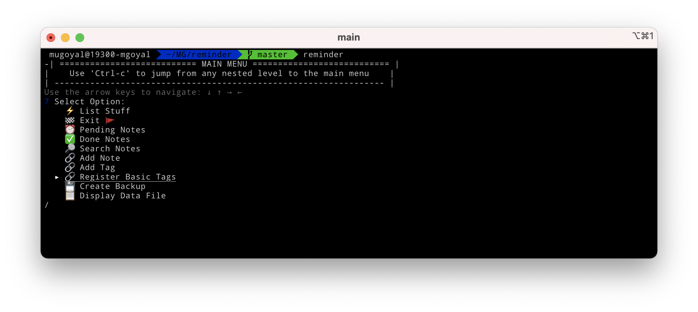
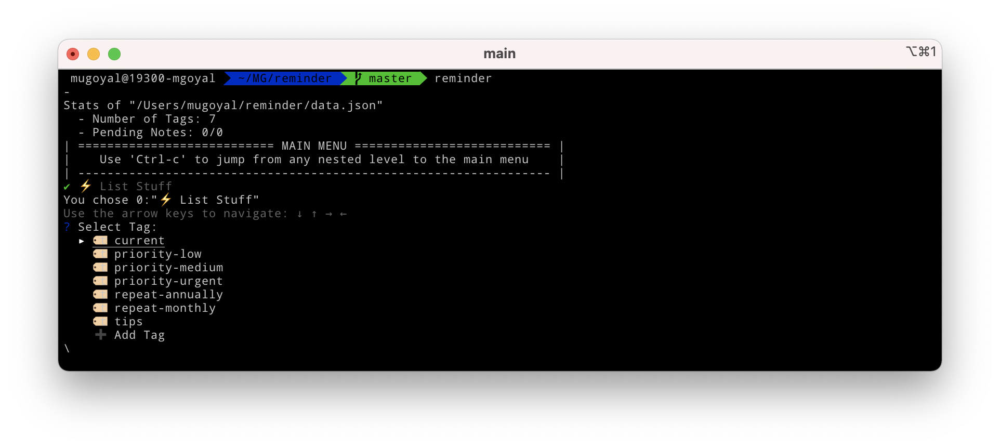
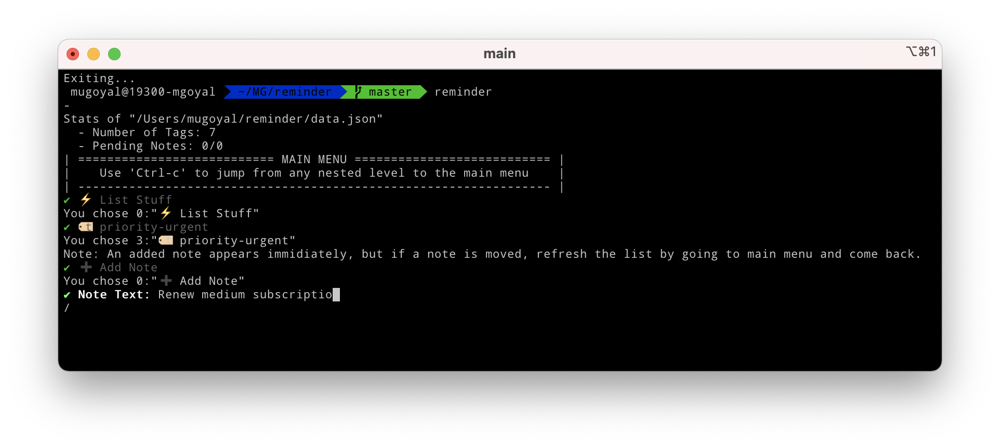
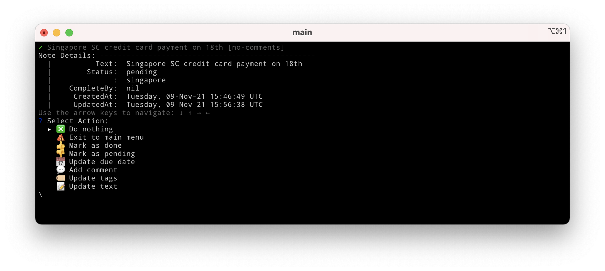
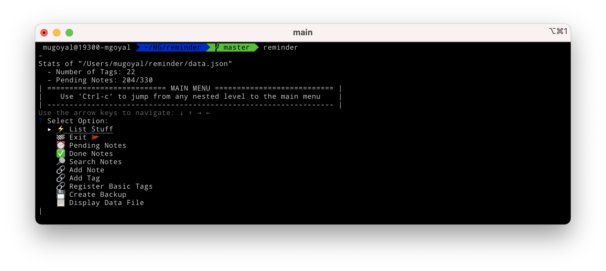
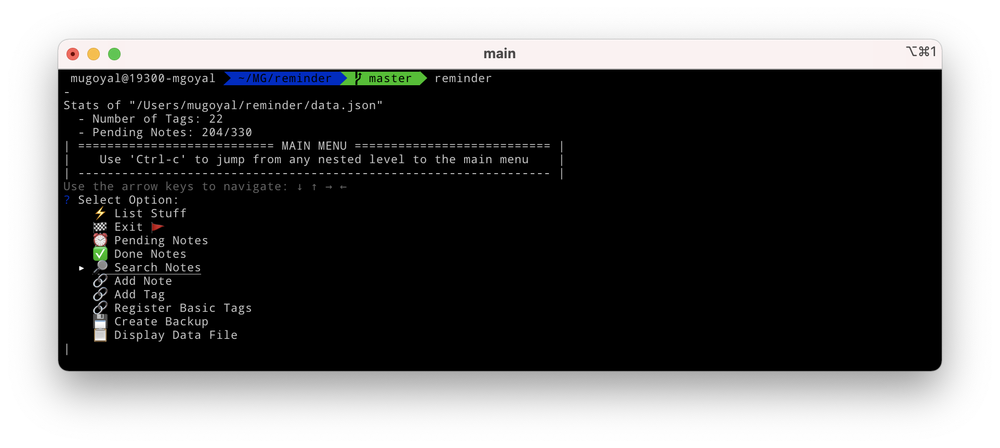
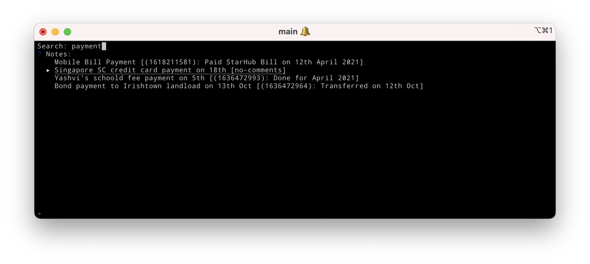

<!-- START doctoc generated TOC please keep comment here to allow auto update -->
<!-- DON'T EDIT THIS SECTION, INSTEAD RE-RUN doctoc TO UPDATE -->
**Table of Contents**  *generated with [DocToc](https://github.com/thlorenz/doctoc)*

- [Reminder](#reminder)
    - [Yet Another Reminder Tool/App. Why?](#yet-another-reminder-toolapp-why)
    - [How to Use?](#how-to-use)
    - [How to Run?](#how-to-run)
        - [Easily run the tool via Docker (recommended)](#easily-run-the-tool-via-docker-recommended)
        - [Non-Docker Setup](#non-docker-setup)
            - [Install `go`](#install-go)
            - [Install the tool](#install-the-tool)
            - [Run the tool](#run-the-tool)
    - [Features/Issues to be worked upon](#featuresissues-to-be-worked-upon)
    - [Contributing towards development](#contributing-towards-development)

<!-- END doctoc generated TOC please keep comment here to allow auto update -->

# Reminder

## Yet Another Reminder Tool/App. Why?

_This is a simple **terminal-based fully-interactive reminder tool**. It is not for everybody, but for the folks with a software engineering background who need the **speed** of the command-line and have to manage many day-to-day to-do items (like meeting minutes, reminders about ad-hoc tasks, etc.) in an organized way._

_Apart from being **fully-interactive** and **terminal-based**, the other major features it comes with are:_

- Easy to categorize **tasks** (also referred to as **"notes"**) with **tags** (🏷 ).
- List and **manage tasks** (change status, update text, add comments, update due-date, etc) of a given tag.
- Each task can be associated with **multiple tags**, and so show up under all of its tags.
- A given task:
    - can be **updated** (📝) with its text, and also can be enhanced with time-stamped **comments** (💬); so that you can track how and when the progress happened
    - can be marked **done** (✅) or **pending** (⏰); marking it as "done" makes it invisible
    - can be associated with **due-date** (📅); tasks with upcoming deadlines automatically show up under the **"~Pending~ Approaching Due Date"** option under **Main Menu**
    - can be set as "main" or non-main (incidental)
- **Full-text search** (🔎) among all tasks.
- **Tag-groups** for grouping tags, for managing priority-levels (⬆️ ⬇️) or workflow-stages.
- Provides you with **"Register Basic Tags"** functionality to seed basic tags which have special meaning to the workflow.
- All of your **data** (📋) remains with **only you**; so, any of your sensitive information doesn't leave your machine.
- The **data** remains in a human-readable and usable format. This is useful even if you choose to move away.
- Easily take **time-stamped backups** (💾).
- Provides you a way to easily add/remove tags to any of the existing tasks.

Nothing is hidden (except your data)! The tool is Open Source. You are welcome to use, recommend features, raise bugs, and enhance it further.

## How to Use?

The [Screencast of Basic Features](./assets/videos/screencast_basic_features.mov) can provide you with gist of how the tool looks like and its basic functionality (but there is a lot more that you can do with it).

Once you invoke the tool (for example, by using the [alias **`reminder`**)](#easily-run-the-tool-via-docker-recommended), you are presented with its **Main Menu**. Use **Up-Arrow** and **Down-Arrow** keys to navigate up and down:

<p align="center">
  
</p>

You may like to take a good look at the options of the **Main Menu** (as shown above), as we'll be talking about it through out this guide.

Also note that you can choose an option by pressing **Enter** key, and use **Ctrl-c** to jump from any nested level to **one level up** (towards the the **Main Menu**).

In [`reminder`](https://github.com/goyalmunish/reminder), the **tags** are the main method of categorizing tasks. When you first time start the app, the tag list is empty, but you can use the **"Register Basic Tags"** option (the option pointed out by the selection-cursor in the above figure) to register basic tags (as listed in the figure below). Then, you can use the **"List Stuff"** option to list them out (as shown below figure).

As we'll see, the **"List Stuff"** option is the most frequently used option in this list. It lets you add tags, add tasks (also referred to as "notes") under those tags, update those tasks; so almost 90% of use-cases.

<p align="center">
  
</p>

Now, from within the **"List Stuff"** option, you can add a new tag using **"Add Tag"** (as shown at the bottom of the above figure) or choose an existing tag to add a **task** to it. For example, the following figure shows state of the UI when you select a tag (such as **"priority-urgent"**) to add a new task under it:

<p align="center">
  
</p>

On selecting a tag (navigating to the tag and hitting **Enter** key), all of its tasks show up as a list of selectable items. You can then **navigate to a given task** and hit **Enter** key to bring up a **menu to update the task** (it lets you change its text, add comments, mark it as pending, mark it as done, add due-date, change its existing tag(s)). The following figures shows you how this menu looks like:

Note: The **"~Pending~ Approaching Due Date"** shows you tasks that require your immediate attention. In general, tasks with a **due-date** in upcoming `7` days start showing up under this option (and remain there until they are marked done). The tags **"repeat-monthly"** and **"repeat-annually"** are special; tasks tagged with them also show up under the **"~Pending~ Approaching Due Date"** option close to their due-dates in their respective monthly and annual frequencies. These rules are also listed under **"~Pending~ Approaching Due Date"** option as a reference.

<p align="center">
  
</p>

With time, you will add more tags and hundreds of tasks under them. These **stats** will show up **on top of your main-menu screen** (as shown below):

<p align="center">
  
</p>

The above status states that there are currently 22 tags, a total of 330 tasks, and out of them 204 tasks are in the **"pending"** state. The tasks marked as **"done"** become **invisible** (but not deleted, and will still show up under **"Done Notes"** and in Search results).

The **"Search Notes"** option lets you perform a **full-text search** (with each task's status, text and its comments) through all tasks. You can use `[done]` as search text to filter only tasks which are done, similarly use `[pending]` for tasks which are pending.

<p align="center">
  
</p>

The **result list** updates as you add or delete characters in the **search field** (without hitting Enter-key):

<p align="center">
  
</p>

The figures such as 1618211581 that you see in the above results are timestamps of the comments added to the corresponding tasks.

You can navigate to a search entry (a task) and hit **Enter** key to bring up the **menu to update the task** (similar to how we updated tasks under a tag):

<p align="center">
  
</p>

Additionally, from the **Main Menu**:

- use the **"Exit"** option to exit the tool. You can come back it to later from where you left off (that is, with your data intact)
- use the **"Create Backup"** option to create time-stamped backup of your data file (on host machine)
- use the **"Done Note"** option to display done tasks (which are otherwise invisible under the **"List Stuff"**)

## How to Run?

### Easily run the tool via Docker (recommended)

_This is the easiest way to get going, if you have [Docker](https://docs.docker.com/get-docker/) installed. Just issue the following commands:_

```sh
# pull the image
docker pull goyalmunish/reminder

# make sure the directory for the data file exists on the host machine
mkdir -p ~/reminder

# spin up the container, with data file shared from the host machine
docker run -it -v ~/reminder:/root/reminder goyalmunish/reminder
```

_For subsequent runs, better add the below alias to `~/.bashrc` ( or `~/.zshrc`, etc), so that you can invoke the tool, just by typing `reminder`:_

```sh
alias reminder='docker run -it -v ~/reminder:/root/reminder goyalmunish/reminder'
```

_Run the tool:_

```sh
reminder
```

### Non-Docker Setup

#### Install `go`

On Mac, you can just install it with `brew` as:

```sh
brew install golang
```

For other platforms, check [official `go` download and install guide](https://golang.org/dl/).

Otherwise, you can also use one of the [Golang Offical Images](https://hub.docker.com/_/golang) to run tool from a Docker container. For example,

```sh
GOLANG_IMAGE=golang:1.17.2-alpine3.14
GOLANG_VERSION=1.17

# run the image
docker pull ${GOLANG_IMAGE}
docker run -it -d --privileged --name golang${GOLANG_VERSION} ${GOLANG_IMAGE}

# exec into the container
docker exec -it golang${GOLANG_VERSION} /bin/sh
```

If `git` and `ssh` are not available (for instance case of fresh `alpine` image, from above), install them as:

```sh
apk add git
apk add openssh
```

Check installed version:

```sh
go version
```

#### Install the tool

Clone the repo:

```sh
git clone git@github.com:goyalmunish/reminder.git
```

If this results in Permission issues, such as `git@github.com: Permission denied (publickey).`, then either you [Setup Git](https://git-scm.com/book/en/v2/Getting-Started-First-Time-Git-Setup) or just use `git clone https://github.com/goyalmunish/reminder.git` instead.

Install the tool as:

```sh
cd reminder
go install cmd/reminder/main.go
mv ${GOPATH}/bin/main ${GOPATH}/bin/reminder
```

#### Run the tool

If your `go/bin` path is alreay in `PATH`, then you can just run the tool as:

```sh
reminder
```

## Features/Issues to be worked upon

Check [**Issues**](https://github.com/goyalmunish/reminder/issues) to track bugs and request for new features.

## Contributing towards development

Check [Development Guide](./dev_guide.md).
